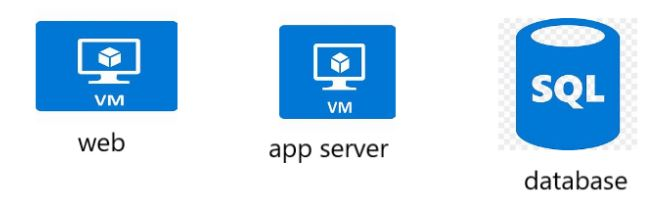
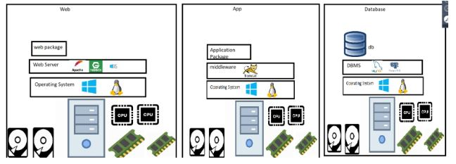
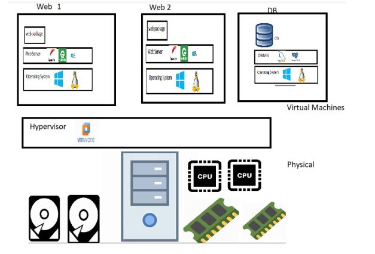
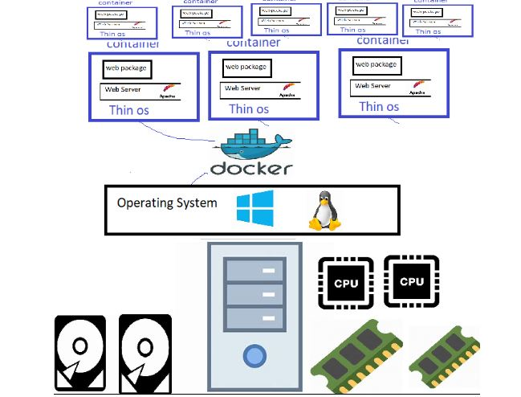

First we will understand running the applications on the server.

Consider this as your application architecture.

Generation 1: Physical servers

 To run our applications we need to procure physical servers(bare metal) with decent configuration install necessary infrastructure to run our application.

 

 Your application is using the hardware to run and utilization is low.

 Costs involved are:
  1. For purchasing the servers before we deploy our application (Capex)
  2. For maintaining the server during application is in use (opex)

There are most likely chances that you under use your hardware.

Generation 2: virtual Machines

  1. Hypervisors came into existence.
  2. Hypervisors are the softwares installed on the physical machines which help you in creating virtual machines
   Examples: VmWare, Hyper-V, KVM, Virtual Box etc.
  3. VMWare became very populare which allows to create multiple vms on the same physical server. (Server Virtualization)

 

 Generation 3: Docker

 Linux had a concept of containers from day 1, but it was difficult to create and very few organizations like google were using them.
 Docker made is simple to create containers.

 

 Consider container as an isolated area with cpu, ram and network which makes application belive that it running on full blown os.
 Since containers are light weight we can run many containers on the server.

 Installation:

 Once docker is installed a group created with the name docker.

 To run the docker commands, user needs to be added in docker group.

 usermod -aG docker centos

 Docker commands:
 -----------------------------------

 1. docker images
    -- It will list down all images in our local machine.

 2. docker pull image-name:version
    -- It will pull the image into our local from docker hub.

 image = static
 
 container = when you run image you get container.

 3. docker create image-id
    -- It will create the container only

 4. docker ps
    -- It will list down the running containers.

 5. docker ps -a
    -- It will list down all the containers that are in running and stopped state.

 6. docker run image:version = pull image + created container + started container.

 7. docker rm `docker ps -a -q` 
    -- removing all containers.
   
 8. docker rmi `docker images -a -q` 
    -- remove all images.  

 9. docker rmi <image-id> 
    -- removes particular image.

10. docker run -p <host-port>:<container-port> image
    -- with this command we can bind vm port with container port
    docker run -p 80:80 nginx --> runs in foreground and attaches to screen, we cant run anything.

11.  docker run -d image-name 
     -- detach the screen and run in background.

12. docker exec -it <id> bash/sh
    -- To login inside the container.

13. docker logs <container-id>
    -- To see the logs of the running container.     