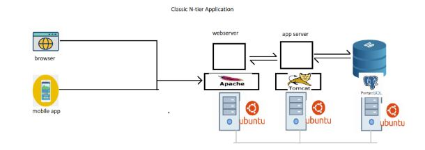
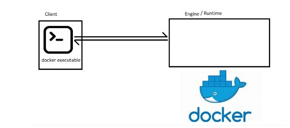

First we will understand running the applications on the server.

Consider this as your application architecture.


Generation 1: Physical servers

 To run our applications we need to procure physical servers(bare metal) with decent configuration install necessary infrastructure to run our application.

 

 Your application is using the hardware to run and utilization is low.

 Costs involved are:
  1. For purchasing the servers before we deploy our application (Capex)
  2. For maintaining the server during application is in use (opex)

There are most likely chances that you under use your hardware.

Generation 2: virtual Machines

  1. Hypervisors came into existence.
  2. Hypervisors are the softwares installed on the physical machines which help you in creating virtual machines
   Examples: VmWare, Hyper-V, KVM, Virtual Box etc.
  3. VMWare became very populare which allows to create multiple vms on the same physical server. (Server Virtualization)

 

 Generation 3: Docker

 Linux had a concept of containers from day 1, but it was difficult to create and very few organizations like google were using them.
 Docker made is simple to create containers.

 

 Consider container as an isolated area with cpu, ram and network which makes application belive that it running on full blown os.
 Since containers are light weight we can run many containers on the server.

What does it take to run applications?
 
 Lets consider bookmy show as an application example

 
  
  To run the application , we require the following components:


1. necessary softwares to be installed (java)
2. Software package to be downloaded (spring petclinic)
3. network: ipaddress and port
4. cpu, ram and disk
 
Lets see what container offers

Inside the container also,

we have an os

1. network
2. cpu/ram/storage
3. necessary softwares
4. we downloaded package
5. we executed application.
 

Installation on centos:8 :

```
 sudo yum install -y yum-utils
```
sudo yum-config-manager --add-repo https://download.docker.com/linux/centos/docker-ce.rep
```
sudo yum install docker-ce docker-ce-cli containerd.io docker-buildx-plugin docker-compose-plugin -y
```
sudo systemctl start docker
```
usermod -aG docker centos

or 

```
curl -fsSL https://get.docker.com -o get-docker.sh
sh get-docker.sh

sudo docker run hello-world

 Once docker is installed a group created with the name docker.

 To run the docker commands, user needs to be added in docker group.

 usermod -aG docker centos

Docker has two major components

1. Client
2. Engine/Runtime/Server



 Docker commands:
 -----------------------------------

 1. docker images
    -- It will list down all images in our local machine.

 2. docker pull image-name:version
    -- It will pull the image into our local from docker hub.

 image = static
 
 container = when you run image you get container.

 3. docker create image-id
    -- It will create the container only

 4. docker ps
    -- It will list down the running containers.

 5. docker ps -a
    -- It will list down all the containers that are in running and stopped state.

 6. docker run image:version = pull image + created container + started container.

 7. docker rm `docker ps -a -q` 
    -- removing all containers.
   
 8. docker rmi `docker images -a -q` 
    -- remove all images.  

 9. docker rmi <image-id> 
    -- removes particular image.

10. docker run -p <host-port>:<container-port> image
    -- with this command we can bind vm port with container port
    docker run -p 80:80 nginx --> runs in foreground and attaches to screen, we cant run anything.


11.  docker run -d image-name 
     -- detach the screen and run in background.

12. docker exec -it <id> bash/sh
    -- To login inside the container.
```
13. docker logs <container-id>
    -- To see the logs of the running container.     
```
docker run <container-ID> command

command --> env --> it will display the environment variables

Sample Docker file
---------------------------------------

```
FROM openjdk:11
LABEL author=AnilKumar
RUN wget https://referenceapplicationskhaja.s3.us-west-2.amazonaws.com/spring-petclinic-2.4.2.jar
EXPOSE 8080
CMD ["java", "-jar", "/spring-petclinic-2.4.2.jar"]

In the above Dockerfile the instructions are

FROM

LABEL

RUN

EXPOSE

CMD

This Dockerfile when executed with 
```docker image build -t <image>:<tag> <directory with docker file>```

will try to create a container based on base image and run all the necessary instructions and creates the image

When we start the container from image whatever is mentioned in CMD/ENTRYPOINT gets executed.

ADD vs COPY
-----------------
ADD also copy files from local to container, it has 2 extra options

1. it can directly get the content from internet and copy
2. it can directly untar the file to the location

CMD vs ENTRYPOINT
---------------------
1. CMD command can be overriden by any command.
2. ENTRYPOINT can't be overriden
3. You cant override entrypoint, if you try to do it will do and append to entrypoint
4. If user is not giving any options, CMD can supply default arguments to ENTRYPOINT
5. user can always override CMD through terminal

for best results combine both entrypoint and cmd

ARG vs ENV
-------------------
1. ARG variables only work in build time, but ENV variables can work in build as well as runtime/in container.
RUN vs CMD
CMD vs ENTRYPOINT
ADD vs COPY

ONBUIILD
-------------
We are developing docker images, someone else may use our images...

as a image developer, I need to make some rules

ONBUIILD instruction will not execute at the time of image build by developer...

ONBUIILD will execute at the time of some one use your image.


